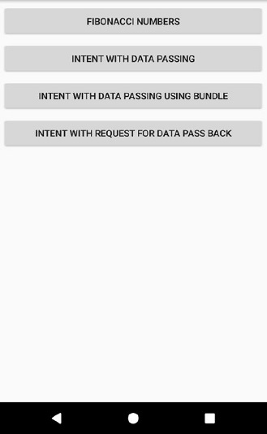
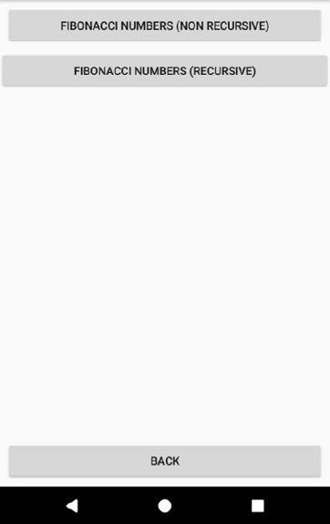
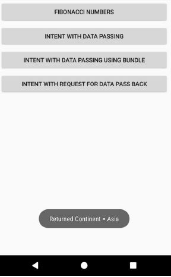

# IntentApp
This is the repository that contains both the starter and finished application which is written in Kotlin.

## Getting Started
1. Download the code.
2. Pick either the starter or finished directory and open the "Intent" folder in Android Studio.
3. Run the app.

## Introduction
A mobile application that uses Intent to switch between pages in Kotlin using Android Studio.
The project gradle is named "Intent".
The layout intended for the application is shown in the screenshots below. 

The MainActivity, which is the app’s launching activity, should show 4 buttons.
1. Fibonacci Numbers
2. Intent with Data Passing
3. Intent with Data Passing using Bundle
4. Intent with Request for Data Pass Back

### Fibonacci Numbers
Upon pressing the first button of MainActivity (“Fibonacci Numbers”), the screen will be switched to an activity.

When the button “Back” is pressed, MainActivity re-appears. 

When the button “Fibonacci Numbers (Non Recursive)” is pressed, it will switch to the activity shown below. When the button “Fibonacci Numbers (Recursive)” is pressed, the activity shown and its interaction results are identical. The only difference is, the Fibonacci numbers are generated using a recursive function.

### Intent with Data Passing
Upon pressing “Intent With Data Passing” of MainActivity, the screen will be switched to another activity, with a Toast message.

A Toast message shows the data passed from MainActivity.
The (key,value) pairs passed from MainActivity are as follows:
(“Country”, “Singapore”) , (“Sports”, “Football”), (“Team Size”, 11)
Note that the mode of data passing is not by Bundle object.
When “Back” is pressed, MainActivity re-appears.

Upon showing this activity, a message showing the data passed from MainActivity will be toasted.

### Intent with Data Passing using Bundle
Upon pressing “Intent With Data Passing Using Bundle” of MainActivity, the screen will be switched to another activity, with a Toast message.

A Toast message shows the data passed from MainActivity.
The (key,value) pairs passed from MainActivity are as follows:
(“Country”, “Indonesia”) , (“Sports”, “Badminton”), (“Team Size”, true)
Note that the mode of data passing is by Bundle object.
When “Back” is pressed, MainActivity re-appears.

Upon showing this activity, a message showing the data passed from MainActivity will be toasted.

### Intent with Request for Data Pass Back
Upon pressing “Intent With Request for Data Pass Back” of MainActivity, the screen will be switched to another activity. Pressing the “Back” button will return to MainActivity.

MainActivity will request the activity being called to return some data. The key-value pair for the data returned will be (“Continent”, “Asia”). Upon returning to MainActivity, a message will be toasted to say “Returned Continent = Asia”.

